<h1 align="center">fpick</h1>

<p align="center">
interactively pick a file to run a command against
</p>



<p align="center">
   <a href="#install">        🔧 <strong>Install</strong></a>
 · <a href="#usage">          ⚽ <strong>Usage</strong></a>
 · <a href="https://github.com/stagas/fpick/releases"> 🔥 <strong>Releases</strong></a>
 · <a href="#contribute">     💪🏼 <strong>Contribute</strong></a>
 · <a href="#credits">        🍻 <strong>Credits</strong></a>
 · <a href="https://github.com/stagas/fpick/issues">   🖐️ <strong>Help</strong></a>
</p>

---

## Install

```sh
$ npm i fpick -g
```

## Usage

```sh
$ fpick <path> -- <command> [...args]
```

or without installing globally:

```sh
$ npx fpick <path> -- <command> [...args]
```

## Credits

- [fc-filepick](https://github.com/agrublev/fc-filepick) by [agrublev](https://github.com/agrublev)

## Contribute

[Fork](https://github.com/stagas/fpick/fork) or
[edit](https://github.dev/stagas/fpick) and submit a PR.

All contributions are welcome!

## License

MIT &copy; 2021
[stagas](https://github.com/stagas)
